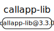
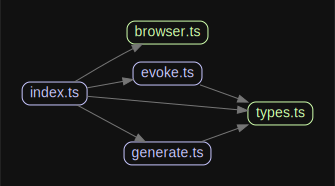

# 源码分析

## 文件结构

``` bash
/Users/liufang/openSource/FunnyLiu/callapp-lib
├── README.md
├── _config.yml
├── commitlint.config.js
├── example
|  ├── README.md
|  ├── package-lock.json
|  ├── package.json
|  ├── public
|  |  ├── favicon.ico
|  |  ├── index.html
|  |  ├── logo192.png
|  |  ├── logo512.png
|  |  ├── manifest.json
|  |  └── robots.txt
|  ├── src
|  |  ├── App.css
|  |  ├── App.tsx
|  |  ├── index.css
|  |  ├── index.tsx
|  |  └── react-app-env.d.ts
|  ├── tsconfig.json
|  └── yarn.lock
├── package-lock.json
├── package.json
├── rollup.config.js
├── src
|  ├── browser.ts
|  ├── evoke.ts
|  ├── generate.ts
|  ├── index.ts
|  └── types.ts
├── tsconfig.json
└── types
   └── global.d.ts

directory: 5 file: 29

ignored

```

## 外部模块依赖



## 内部模块依赖


  